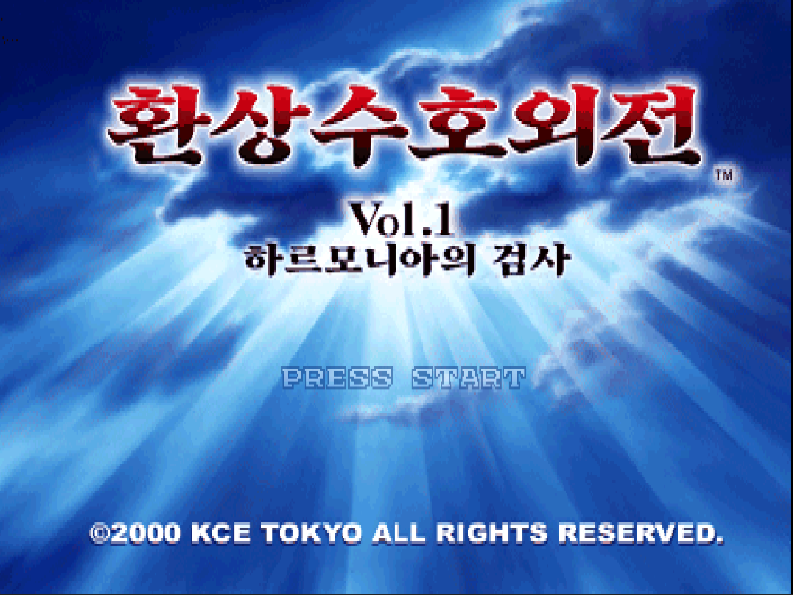

# 환상수호외전 Vol.1 하르모니아의 검사 한국어 패치



PlayStation 일본판 『幻想水滸外伝 Vol.1 ハルモニアの剣士』용 비공식 한국어 번역 패치입니다.
게임 이미지는 배포하지 않으며, 본인이 가진 원본 이미지에 적용하는 xdelta 차분 패치만 제공합니다.

> ⚠️ **패치는 반드시 아무것도 적용하지 않은 원본 이미지에 적용하세요.**

> **처음부터 엔딩까지 한 번 플레이하며 검수했지만, 모든 선택지 갈래와 동작을 확인한 것은 아닙니다.**
> 오역, 어색한 문구, 멈춤이나 글자 깨짐이 남아 있을 수 있습니다.

## 지원 원본

| 항목 | 값 |
|---|---|
| 게임 | 幻想水滸外伝 Vol.1 ハルモニアの剣士 (일본판, SLPM-86637) |
| 파일 | `Gensou Suiko Gaiden Vol. 1 - Harmonia no Kenshi (Japan).bin` (트랙 1개, MODE2/2352) + `.cue` |
| 크기 | 501,775,680 바이트 |
| CRC32 | `B129D176` |
| MD5 | `87d317bd9a1a90d62e366b1fb969ed65` |
| SHA-1 | `a80e08e9b0687600bebc7f96b9749b4fbf9c9e05` |
| SHA-256 | `973897e089588923dd1e7c21a55ecbac98ad5fdeb60f8e8a97963419b6884d53` |

해시가 다르면 패치가 적용되지 않거나 결과가 달라집니다. 적용 전에 `.bin` 파일의 해시를 꼭 확인해 주세요.

## 패치 파일

| 파일 | 크기 | SHA-256 |
|---|---|---|
| `Suikogaiden_Vol1_KR_v0.5.0.xdelta` | 3,688,395 바이트 | `9de37313b50006f96bc810ee1c6d91e1a7cef9d2dc662e5b72ab33d529a3ff8d` |
| `suikogaiden1_kr.cue` | 81 바이트 | 결과 `.bin`용 cue 파일 |

[Releases](../../releases)에서 받을 수 있습니다.

## 적용 방법

### xdelta UI / Delta Patcher (Windows)
1. `Suikogaiden_Vol1_KR_v0.5.0.xdelta`와 `suikogaiden1_kr.cue`를 받습니다.
2. xdelta UI 또는 Delta Patcher에서 **Patch**에 xdelta 파일, **Source**에 원본 `.bin` 파일을 지정합니다.
3. 결과 파일 이름을 `suikogaiden1_kr.bin`으로 정하고 적용합니다.
4. 받은 `suikogaiden1_kr.cue`를 결과 `.bin`과 같은 폴더에 두고, 에뮬레이터에서 이 `.cue`를 엽니다.

### xdelta3 명령줄
```
xdelta3 -d -s "Gensou Suiko Gaiden Vol. 1 - Harmonia no Kenshi (Japan).bin" Suikogaiden_Vol1_KR_v0.5.0.xdelta suikogaiden1_kr.bin
```

결과 파일 이름을 다르게 정했다면, 원본 `.cue`를 복사해 `FILE "…"` 줄의 파일 이름만 바꿔 써도 됩니다.

### 적용 결과 확인

| 항목 | 값 |
|---|---|
| 크기 | 501,775,680 바이트 |
| CRC32 | `9ACD6E74` |
| SHA-1 | `5186185f265d194e438b1b76222da099770b6582` |
| SHA-256 | `9707ad82a950158e9ba5d0459e61bdf3d651a49e0b916c43b436e4e51a33e46e` |

## 현재 상태 (v0.5.0)

- 대사, 선택지, 메뉴, 메모리카드·세이브 연동 안내 문구를 한국어로 표시합니다.
- 타이틀 로고, 에피소드 제목 카드, 엔딩 영상의 로고와 제작사 화면을 한글로 바꿨습니다.
- 엔딩 스태프 롤과, 콘솔(에뮬레이터)의 메모리카드 관리 화면에 보이는 세이브 제목은 원문 그대로입니다.
- 한글 표시를 위해 게임 실행 파일(소프트 리셋 뒤 실행되는 `CHILD.EXE` 포함)과 글꼴 자료를 수정했습니다.
- 한글 글자는 원래 화면 비율(4:3)에서 읽기 좋게 맞췄습니다.
- 확인 환경: DuckStation 에뮬레이터. 실기(PS1)에서는 확인하지 않았습니다.

### 플레이 안내

- **빨리 감기(배속)는 쓰지 않는 것을 권합니다.** 배속 중에 장면이 바뀌거나 영상이 나오면 소리만 나고 화면이 멈출 수 있습니다. 멈추면 배속을 끄고 직전 세이브(또는 세이브 스테이트)를 다시 불러와 진행하세요. 배속을 쓴다면 자주 저장해 두세요.
- **화면 비율이나 와이드스크린 옵션은 게임 시작 전에 정하세요.** 게임 도중에 바꾸면 화면이 멈출 수 있습니다.
- **빠르게 진행하려면**: 게임 메뉴(△) → 메시지 표시 → "즉시"로 바꾸고, 에뮬레이터의 CD-ROM 읽기 속도 향상(DuckStation: Read Speedup)을 쓰세요.
- 한 번 클리어하면 R1 버튼으로 이미 본 대사를 빠르게 넘길 수 있습니다.

### 알려진 문제

- 환상수호전Ⅱ 세이브 연동(주인공 이름 등)은 확인하지 못했습니다. 연동하지 않아도 진행에는 문제가 없습니다.

문제를 발견하면 Issues에 장면, 스크린샷, 사용한 에뮬레이터(또는 실기)를 함께 알려 주세요. 멈춤이면 멈추기 직전에 한 조작도 같이 적어 주시면 빨리 찾을 수 있습니다.

## 변경 이력

### v0.5.0 (2026-10-06)
- 첫 공개 릴리스.

## 글꼴

이 패치는 글꼴 파일을 담지 않고, 아래 글꼴로 미리 그린 글자 그림만 게임 자료에 넣었습니다.

| 쓰인 곳 | 글꼴 | 라이선스 |
|---|---|---|
| 대사·메뉴 본문 글자, 반각 영숫자, CG 수집률 표시 | Galmuri14, Galmuri11 | [SIL OFL 1.1](licenses/OFL-Galmuri.txt) |
| 에피소드 제목 카드 | Noto Serif KR | [SIL OFL 1.1](licenses/OFL-NotoSerifKR.txt) |
| 엔딩 영상 제작사 화면 | Noto Sans KR | [SIL OFL 1.1](licenses/OFL-NotoSansKR.txt) |

타이틀과 엔딩 영상의 로고·부제 글씨는 글꼴이 아니라 따로 만든 글씨 그림입니다.

## 감사

번역은 일본어 원문에서 했고, 외전에만 나오는 인물 등 일부 고유명사 표기는 영문 팬 번역(Suikogaiden Translation Project)을 참고했습니다. 먼저 번역을 만든 분들께 감사드립니다.

## 면책

- 이 프로젝트는 팬 번역이며 Konami와 관련이 없습니다.
- 幻想水滸伝(Suikoden)과 관련 상표·저작물의 권리는 각 권리자에게 있습니다.
- 게임 이미지, BIOS, 원본 데이터는 제공하지 않습니다. 본인이 소유한 원본으로만 사용해 주세요.
- 패치 사용으로 생긴 문제에 대해 책임지지 않습니다.
